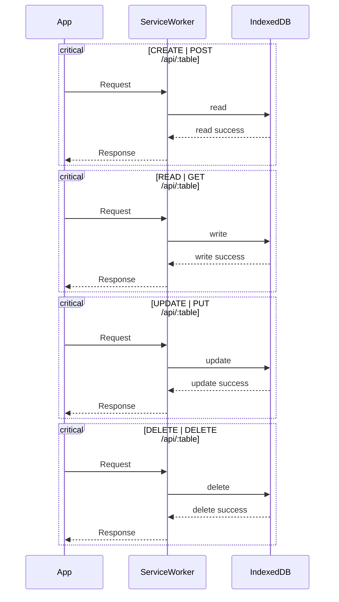

# @glatek/rutabaga

JSON Schema-backed CRUD operations in Service Workers with IndexedDB.

## Description

That short intro is a mouth full. This project takes JSON Schema definitions and:

- Creates API routes for CRUD
- Generates HTML forms
- Stores the data in IndexedDB via Dexie.JS

## Usage

Coming soon...
